# Assembly-Code

## HOW TO RUN SCRIPTS
- Open up your Visual Studio
- Creat New Project
- Section choose C++ and then choose Empty Project.


- In the Project section, right-click first, then select Build Customization from the Build Dependencies section.


- Now click the `masm`

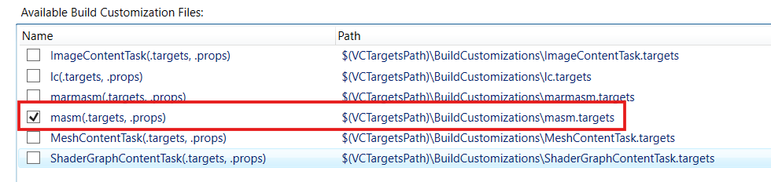

- Right-click in the Project section and select New Item from the Add section.

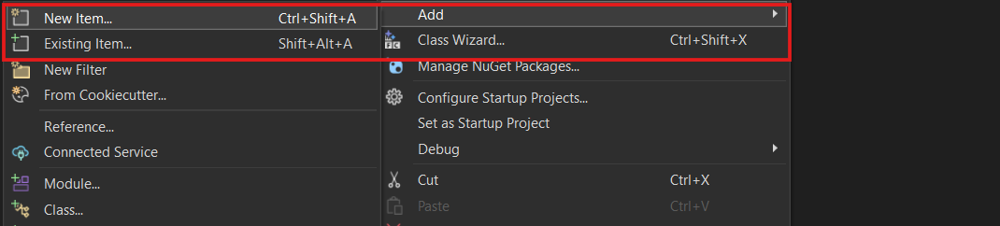

- Make sure to use .asm extension.

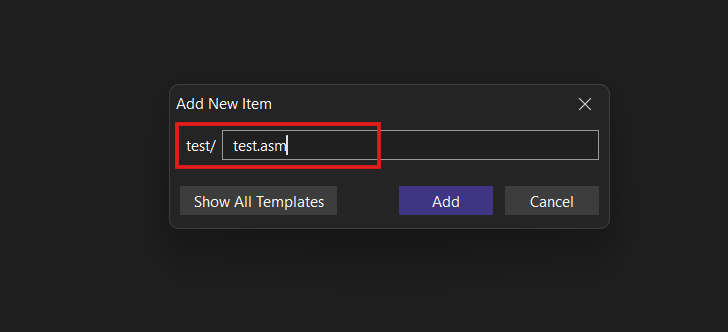

- After this you'll have your code editor ready

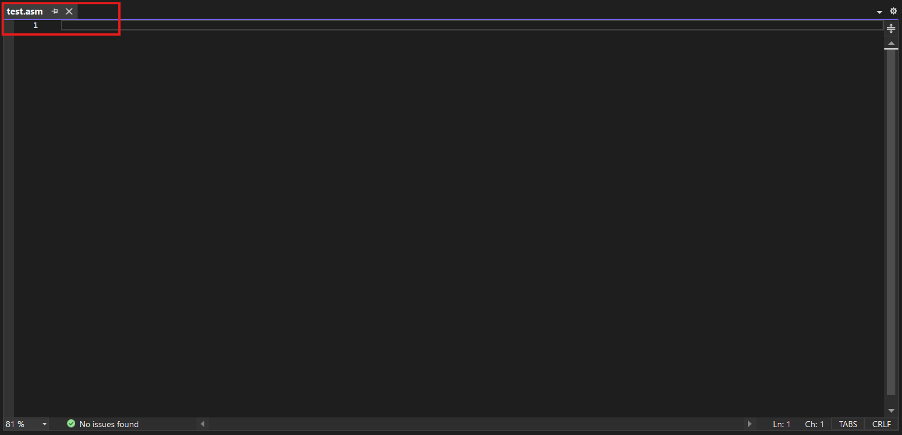

## Setup of Irwin Library
- First, open Google and type irvine32 library.


- Click on the first link.
- Click on code button and download ZIP file.

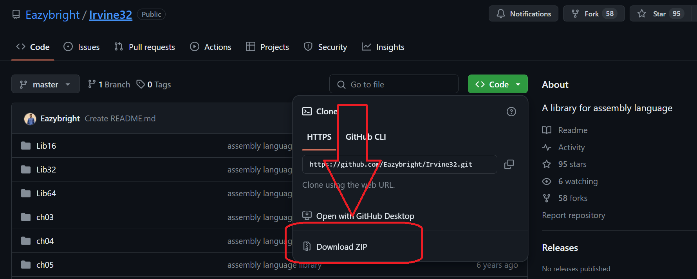

- You see the file and extract the file.

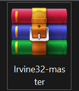

- After Extract the file open the folder.

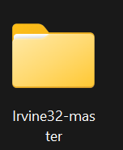

- Copy the address on file.


- Then open the Visual studio.

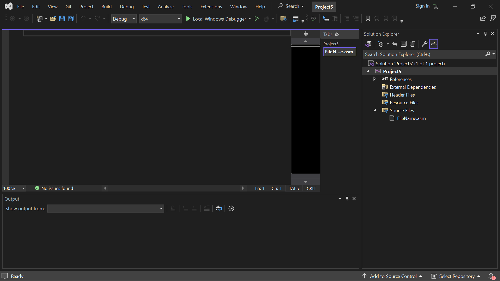

- Press **alt + Enter.**

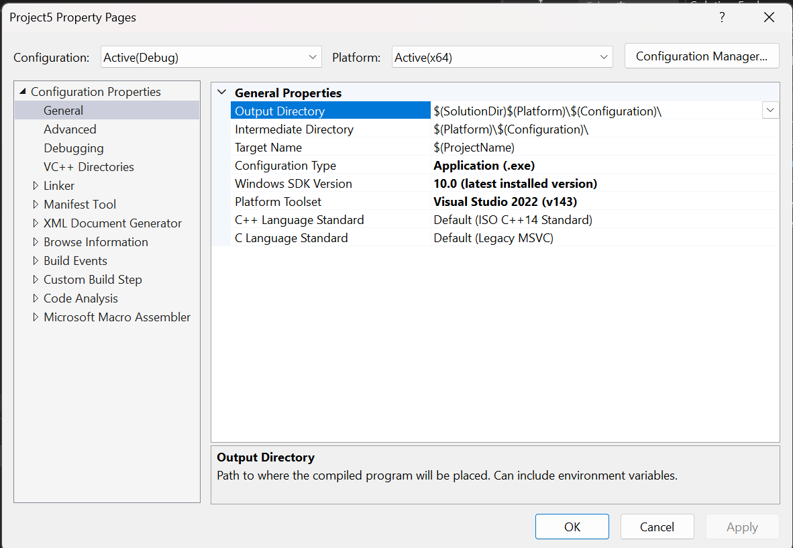

- Click On linker
- Select the additional directories and paste the address of folder.

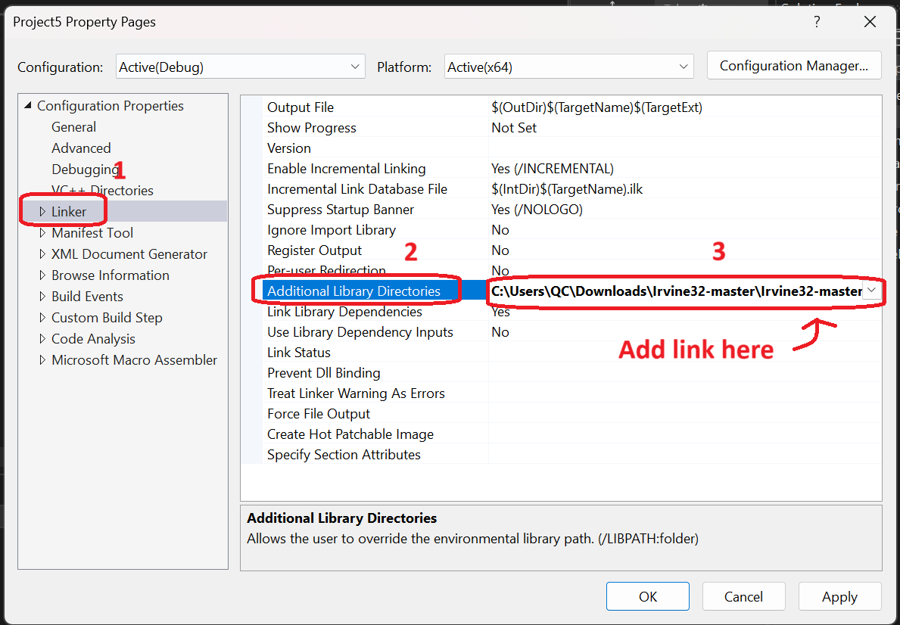

- Then select the input
- Click on additional dependencies
- Write the `irvine32.lib`
- Click on apply and then OK botton

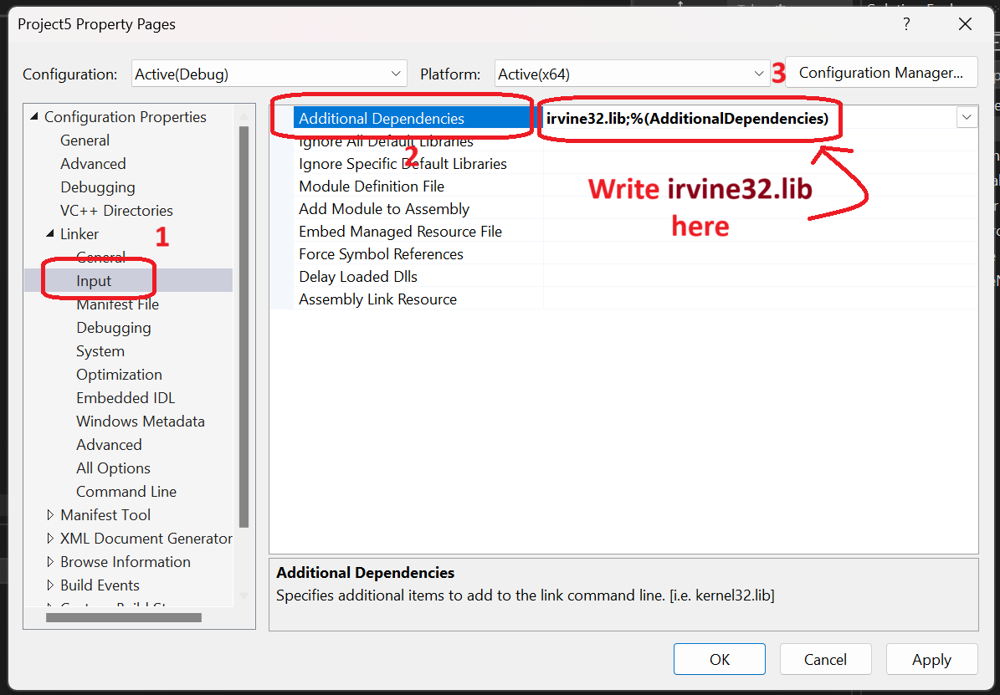

- Just like that write the `irvine32.lib` and click on OK button

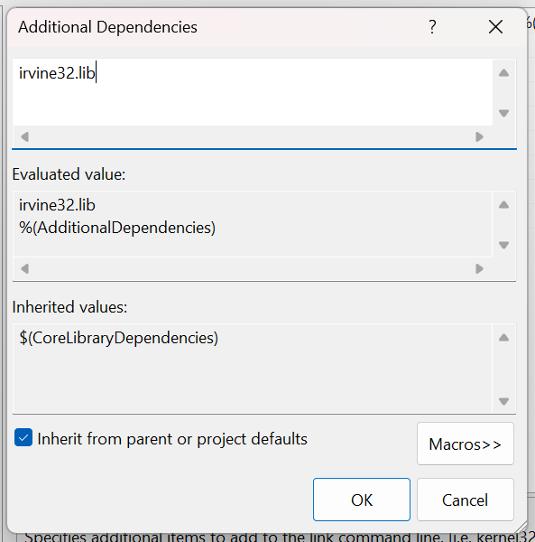

- Select the `.asm` file
- Click on the **properties**

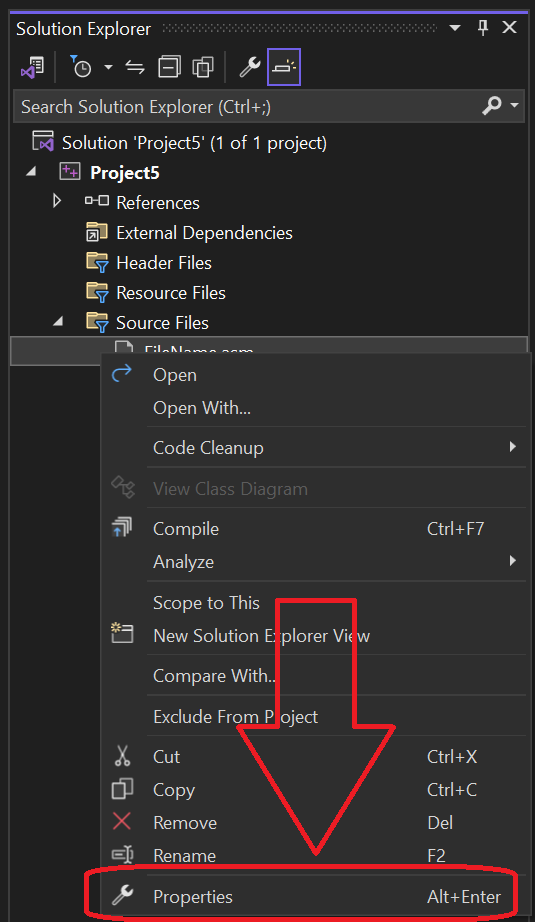

- Select the Microsoft macro assembler
- Click on General
- Select the include paths
- And paste the address of file
- Click on apply and then ok

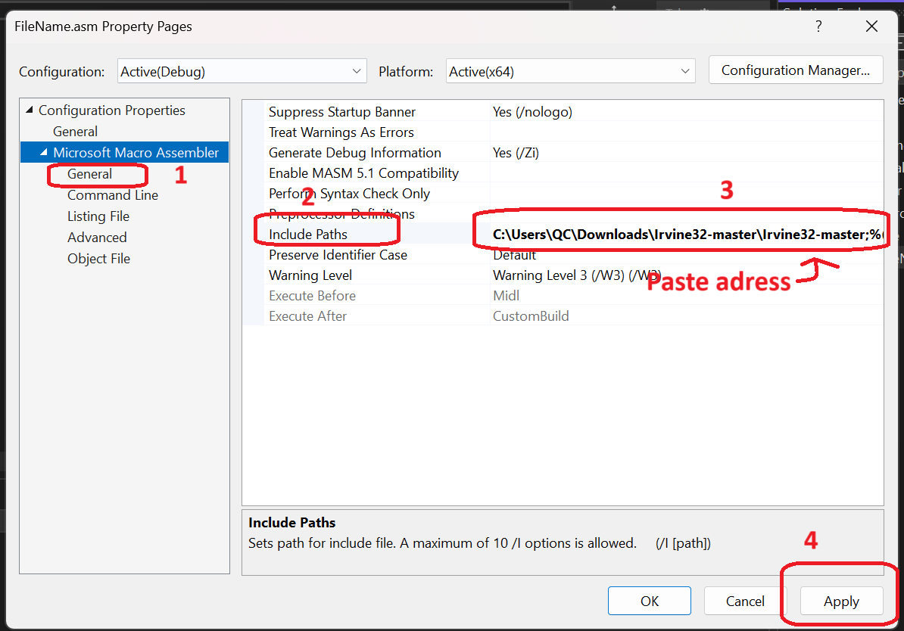

## After setup library

- Write the code of `irvine32 library`
- Here is the example of using irvine32 library

```assembly
; Include Irvine32 library
include Irvine32.inc

.data
    userInput BYTE 80 DUP(?)    
    promptMsg BYTE "Please enter your name: ", 0

.code
main PROC

    mov edx, OFFSET promptMsg   
    call WriteString          

    mov edx, OFFSET userInput   
    mov ecx, SIZEOF userInput  
    call ReadString            

    mov edx, OFFSET userInput   
    call WriteString           

    call Crlf              
    exit        
main ENDP

END main
```

**You see that it will be successful run the code.**

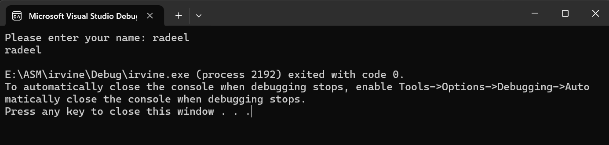


